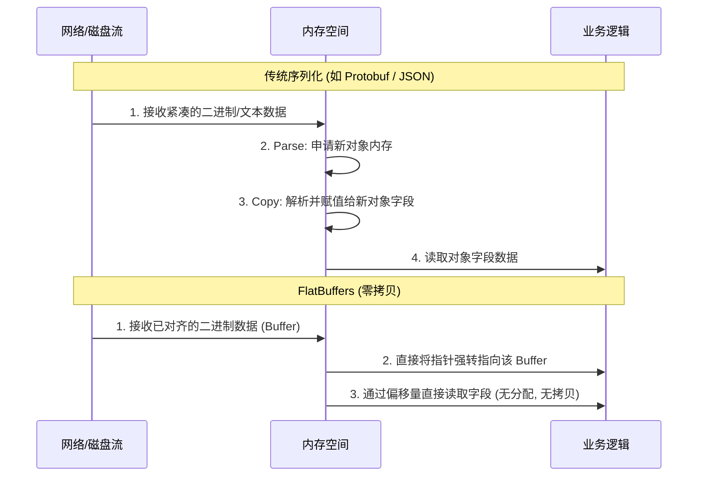

FlatBuffers 也是 Google 出的序列化库，但理念和应用场景和Protobuf不同。它最初是为游戏开发和其他对性能（CPU 和内存）要求极高的应用而设计的。

在探讨高性能网络通信和数据存储时，我们经常会遇到各种序列化协议（如 JSON、Protobuf）。但在对延迟要求极其苛刻的场景下，这些协议的“解析耗时”和“内存分配”往往会成为瓶颈。

FlatBuffers 最核心的设计理念是**“零拷贝”（Zero-copy）**反序列化。

## 核心特点
* **无需解析/解包 (Zero-copy)：** 传统的序列化库在读取数据前，必须将二进制流完整地解析并实例化为内存中的对象（例如在 C++ 中 new 出各种对象）。而 FlatBuffers 将数据序列化成一种特殊排列的二进制缓冲区（Buffer），你在读取时可以直接通过偏移量（Offsets）访问这个缓冲区里的数据，不需要任何解析过程，也不需要分配额外的内存空间。
* **内存效率极高：** 因为不需要将数据反序列化成对象树，不生成临时对象，直接避免了运行时的 GC（垃圾回收）压力，这对于带有 GC 的语言（如 C#、Go、Java）来说是个巨大的福音。
* **强类型系统：** 和 Protobuf 一样，它使用一个 Schema 文件（.fbs）来定义数据结构，并在编译时生成强类型的访问代码。
* **前向/后向兼容：** 支持添加新字段或废弃旧字段，而不会破坏旧版本的兼容性。

## 内存结构与编码设计

一段 FlatBuffers 数据的内部结构大致长这样：
`[元数据表(vtable)] ...... [字段1数据] [填充(Padding)] [字段2数据]`

### 1. 核心灵魂：vtable (虚表)
`vtable` 是一个索引数组。因为数据长度可能是可变的（比如字符串），我们无法在编译期就知道“字段2”到底在哪个确切位置。`vtable` 里面就直接存了各个字段的**相对偏移量 (Offset)**。
* 比如：字段1 在 offset 16，字段2 在 offset 32。
* 读取时：`读取地址 = 基址指针 + vtable[对应字段索引的偏移量]`。

### 2. 填充字节 (Padding)
为了让 CPU 读取速度达到极致（时间复杂度为 O(1)），FlatBuffers 强制要求数据在内存中必须**对齐 (Memory Alignment)**。如果一个 64 位整数前面只有一个 8 位的布尔值，FlatBuffers 会自动插入空白的 Padding 字节，确保 CPU 寻址时能一次性、最高效地把数据载入寄存器。

## 核心原理：“零拷贝” (Zero-Copy)

传统的序列化协议在接收到网络字节流后，通常需要经过一个“解码”过程，在内存中 `new` 出新的对象实例，然后把数据逐个字段赋值过去。这不仅消耗 CPU，还会给垃圾回收（GC）带来巨大压力。

FlatBuffers 完全颠覆了这个过程。它的解码过程**几乎不需要内存分配和数据拷贝**。



1. **接收与指针映射**：当网络层收到数据包后，我们在内存中得到一块二进制 Buffer。此时不需要遍历这块内存，只需调用类似 `GetRootAsUser(buffer_pointer)` 的自动生成方法。这一步在底层**仅仅是一次指针强转**，将这块内存的起始地址映射为我们的根对象视角。
2. **触发读取**：此时，内存里的字段（如 `name`, `age`）还是“静默”状态。直到我们的业务代码真正执行 `user->name()` 时，才会触发寻址。
3. **查表计算**：
   - 底层逻辑首先会找到当前 `user` 对象关联的 **vtable**（元数据表）地址。
   - 在 vtable 中查找 `name` 字段预编译好的**偏移量 (Offset)**。
   - 如果查到的偏移量为 0，说明发送方（可能是老版本）根本没传这个字段，程序直接返回默认值，安全退出; 如果偏移量不为 0，底层将当前对象的基地址加上这个偏移量，精确定位到实际存放数据的内存地址。
4. **直接读取**：到达目标地址后，按照目标类型直接将数据读入 CPU。全程没有发生 `new` 或 `malloc`，也没有数据的深拷贝。


## 缺点

1.  **体积稍大**：为了实现内存直接访问和对齐，内部会有 Padding 填充，且 `vtable` 本身也占用空间。这就牺牲了一定的空间压缩比（通常比 Protobuf 生成的二进制文件要大）。
2.  **使用复杂（心智负担重）**：由于是零拷贝，不能像 Protobuf 那样先 new 一个对象，填满属性后再一把序列化（这通常依赖反射等机制）。在 FlatBuffers 中，你必须“手动把数据塞进二进制缓冲区”，并且**严格按照自底向上（从内向外）的顺序构建**。

**代码对比（以 Go 语言为例）：**

```go
// Protobuf / JSON 的直觉式写法
user := &User{ Name: "白山羊", Age: 25 }
data, _ := proto.Marshal(user) 
```

但在 FlatBuffers 中，你要手动充当“内存搬运工”：
```go
// FlatBuffers Builder 模式（自底向上）
builder := flatbuffers.NewBuilder(1024)

// 1. 必须先创建子对象/动态长度数据（例如字符串）
nameOffset := builder.CreateString("白山羊")

// 2. 开始构建 User 对象
UserStart(builder)

// 3. 将前面生成的偏移量塞进对应字段
UserAddName(builder, nameOffset)
UserAddAge(builder, 25)

// 4. 结束并获取当前对象的偏移量
userOffset := UserEnd(builder)

// 5. 完成整个 Buffer 的构建
builder.Finish(userOffset)
```
因为是直接写内存，不能随意依赖反射，你必须严格遵循这个先子后父的 `Builder` 流程。

## 向后兼容(有序)
* **增加字段**：新字段会被附加在数据结构的末尾，新生成的 `vtable` 会包含它的偏移量。旧版本的客户端读取这段数据时，它手里的 Schema 不认识新字段，只会去读前几个偏移量，互不干扰。
* **字段缺失**：如果新客户端读到了旧数据，`vtable` 中没有新字段的偏移记录，FlatBuffers 会自动返回我们在 Schema 中定义的默认值（比如 0 或 null）。


