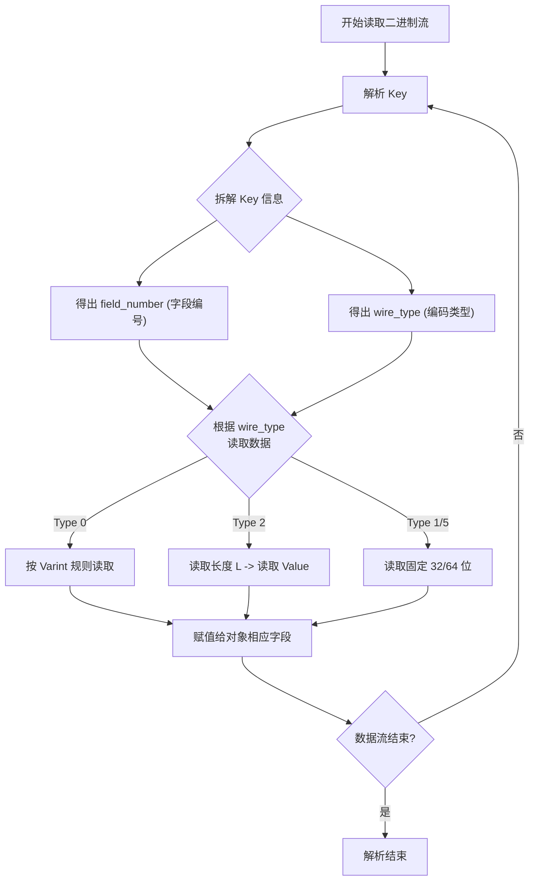

Protocol Buffers。作为 Google 开源的一款轻便高效的结构化数据存储格式，它在 RPC 数据交换和高性能数据存储领域几乎是“标配”。

## 核心优势

在接触 Protobuf 之前，最常用的序列化格式莫过于 JSON 和 XML。但在高并发、对带宽和延迟极其敏感的场景（例如微服务内部的 RPC 调用、高频的网络状态同步）下，纯文本格式的瓶颈就会显现。Protobuf 的优势，主要归功于以下三点：

1. **极致的性能与极小的体积**
   Protobuf 序列化出来的是**紧凑的二进制数据**。相比 JSON 或 XML 的纯文本格式，它的体积通常小 3 到 10 倍，解析速度快 20 到 100 倍。这种“小而快”的特性在海量数据传输时能省下惊人的带宽和 CPU 资源。

2. **出色的跨语言支持**
   它原生支持 C++、Go、Python、Java、C# 等主流语言。我们在实际开发中，完全可以用 C++ 编写服务端发送序列化数据，并由 Python 或 Go 编写的微服务节点轻松接收和解析。因为数据结构在 IDL 中统一定义，我们完全无需担心语言层面的数据类型差异。

3. **极强的向后/向前兼容性**
   在 Protobuf 的 `.proto` 文件中，每个字段都有一个唯一的编号（例如 `id = 1`）。只要不改变这些核心编号，就可以随意增加新字段或废弃旧字段。

   * **向后兼容**：旧版本的代码仍然能够正确读取新格式的数据（遇到不认识的未知字段会直接跳过/忽略）。

   * **向前兼容**：新版本的代码也能读取旧格式的数据（缺失的新字段会使用默认值）。

## 工作流程

在实际项目中引入 Protobuf，通常只需要标准的三个步骤。这里我补充一个简单的例子来直观感受一下：

**1. 定义数据结构 (IDL)**
在一个 `.proto` 文件中，使用 Protobuf 的接口描述语言定义你的数据结构（Message）。

```protobuf
// user.proto
syntax = "proto3";

message User {
    int32 id = 1;         // 这里的 1, 2 就是前文提到的唯一编号
    string name = 2;
    map<string, string> tags = 3;
}
```

**2. 编译生成代码**
使用 Protobuf 编译器（`protoc`），将 `.proto` 文件编译成目标编程语言的代码。例如生成 Go 代码：

```bash
protoc --go_out=. user.proto
```

**3. 在项目中使用**
调用生成的类或结构体，实现数据的序列化（转为二进制）和反序列化（从二进制恢复为对象）。使用生成的代码，我们不需要手写任何解析逻辑。

## 编码规则

### 1. 整数：Varint (可变长度编码)

普通的 `int32` 无论数值大小，都会占用 4 个字节。但实际上我们在应用中传递的数字往往没那么大（比如 1, 50, 100）。
Protobuf 采用 **Varint** 来压缩数值：

* **核心机制**：每个字节的**最高位（MSB, Most Significant Bit）**用来表示“后续是否还有字节”。1 代表有，0 代表这是最后一个字节。

* **数据位**：每个字节剩余的 7 位才用来实际存储数据。
  *(注：如果数字很大，Varint 可能会占用 5 个字节，但综合来看，它对绝大部分小数值的压缩效果极佳。)*

### 2. 字符串与嵌套消息：Length-delimited (长度限定符)

1个字节表示长度, 后面接上内容。

 对于 string、bytes 或者嵌套消息，Protobuf 采用的是通常被称为 **TLV (Tag-Length-Value)** 的编码方式。
它会先用一个 Varint 编码的数字来表示内容的**长度**，紧接着后面放上具体的**字节内容**。这样解析器读到长度后，直接截取对应长度的字节即可，效率极高。

### 3. Map 

在底层，Protobuf 其实没有原生、复杂的 Map 物理结构。定义一个 Map，在编译后实际上会被转换成一个包含 `key` 和 `value` 字段的 **Repeated (数组) 结构体**。

相当于：

```protobuf
// 表面上的 map
map<string, int32> projects = 3;

// 底层实际的等价编码形式
repeated ProjectEntry projects = 3;
message ProjectEntry {
    string key = 1;
    int32 value = 2;
}
```

## 字段编码规则

每个字段在二进制中以 **Key-Value 对** 形式存储：

```
[Key][Value]
```

其中：

### Key = (field_number << 3) | wire_type

- `field_number`：你在 `.proto` 里写的字段编号（如 `id = 1` → 1）
- `wire_type`：数据的物理编码类型（决定 Value 如何读取）

| wire_type | 含义             | 适用类型                     |
|-----------|------------------|------------------------------|
| 0         | Varint           | int32, int64, bool, enum     |
| 2         | Length-delimited | string, bytes, message, repeated |

> 注意：Key 本身也是用 **Varint 编码** 的！

##  解析

当接收到一串二进制流时，Protobuf 是如何将其还原成对象的呢？

解析过程是**从头到尾顺序扫描**的，非常连贯。我用一张流程图来梳理这个过程：



### 特点

* **时间效率高**：**无字段名查找与匹配**。JSON 需要做字符串匹配找 Key（比如找 `"name"`），而 Protobuf 直接通过整数的 `field_number` 映射（常常被编译为简单的 `switch-case`）。**无反射**，生成的代码直接硬编码了读取逻辑。

* **空间利用极致**：**没有标签和结构符号**。二进制流里根本不存在 "id"、"name" 这种字段名字母，全靠 `field_number` 代替；加上 Varint 的数值压缩，榨干了每一滴空间。

##  不按序

最后，值得一提的是 Protobuf 对于数据顺序和完整性的宽容态度。

由于每个数据块都自包含了 `Key (包含编号和类型)`，Protobuf 解析时**完全不依赖字段在二进制流中的出现顺序**。这种“不按序”的设计带来了好处：

1. **分布式系统版本兼容**：当旧系统收到新系统发来的多余字段时，由于顺序无关且知道长度（通过 `wire_type`），它可以安全地跳过这些未知字段。

2. **极佳的稀疏数据支持**：如果你有一个包含 100 个字段的 Message，但这次请求只给其中 2 个字段赋了值，那么序列化时**只包含这 2 个字段的二进制流**。未赋值的字段连“空标签”都不会生成，极致紧凑。

##  具体例子

### 数据定义

假设我们有如下 `.proto` 定义：

```protobuf
syntax = "proto3";

message Person {
  int32 id = 1;        // 字段编号 1
  string name = 2;     // 字段编号 2
  int32 age = 3;       // 字段编号 3
}
```

然后我们创建一个对象：

```protobuf
Person {
  id: 150,
  name: "Alice",
  age: 25
}
```

我们要看它**序列化后的二进制数据长什么样**，并逐字节解析它的结构 —— 尤其是 Tag-Key 部分。


### 逐字段计算 Key 并编码

#### 字段 1: `id = 150`（int32 → wire_type = 0）

- field_number = 1
- wire_type = 0
- Key = (1 << 3) | 0 = 8 + 0 = **8**

用 Varint 编码 `8`：

```
8 的二进制：0000 1000 → 最高位为0，直接1字节：0x08
```

Value = 150（用 Varint 编码）：

```
150 的二进制：1001 0110
拆成 7 位一组：
  第1组：010 1110 → 加 MSB=1 → 10101110 = 0xAE
  第2组：000 0001 → 加 MSB=0 → 00000001 = 0x01
所以 150 → 0xAE 0x01
```

所以 `id=150` 编码为：

```
[0x08] [0xAE 0x01]
```


#### 字段 2: `name = "Alice"`（string → wire_type = 2）

- field_number = 2
- wire_type = 2
- Key = (2 << 3) | 2 = 16 + 2 = **18**

Varint 编码 `18`：

```
18 = 0001 0010 → 1字节：0x12
```

Value = "Alice"（Length-delimited）：

- 先写长度：5 字节（"Alice" 有5个字符）
- 再写内容：'A','l','i','c','e' → ASCII: 0x41 0x6C 0x69 0x63 0x65

所以 Value 部分 = `[0x05] [0x41 0x6C 0x69 0x63 0x65]`

所以 `name="Alice"` 编码为：

```
[0x12] [0x05 41 6C 69 63 65]
```


#### 字段 3: `age = 25`（int32 → wire_type = 0）

- field_number = 3
- wire_type = 0
- Key = (3 << 3) | 0 = 24 + 0 = **24**

Varint 编码 `24`：

```
24 = 0001 1000 → 1字节：0x18
```

Value = 25（Varint）：

```
25 = 0001 1001 → 1字节：0x19（因为小于128）
```

所以 `age=25` 编码为：

```
[0x18] [0x19]
```


### 完整二进制输出

把所有字段拼起来：

```
字段1: 0x08 AE 01
字段2: 0x12 05 41 6C 69 63 65
字段3: 0x18 19
```

 **最终二进制流（16进制）**：

```
08 AE 01 12 05 41 6C 69 63 65 18 19
```

总共 **12 字节**！


### 反向解析 

解码器从头开始读：

1. 读第一个字节：`0x08`
   - Varint 解码 → 值是 8
   - Key = 8 → field_number = 8 >> 3 = **1**, wire_type = 8 & 0x07 = **0**
   - wire_type 0 → 读一个 Varint → 读 `0xAE 0x01` → 解码为 150 → 设置 `id = 150`

2. 下一个字节：`0x12`
   - Key = 18 → field_number = 2, wire_type = 2
   - wire_type 2 → 读一个 Varint 作为长度 → `0x05` = 5
   - 读5字节 → `41 6C 69 63 65` → 解码为 "Alice" → 设置 `name = "Alice"`

3. 下一个字节：`0x18`
   - Key = 24 → field_number = 3, wire_type = 0
   - 读 Varint → `0x19` = 25 → 设置 `age = 25`

解析完成！


### 为什么这体现了“速度快”？

1. **无字段名查找**  
   → 不需要像 JSON 那样比较 `"id"`, `"name"` 字符串，直接用编号 1、2、3 定位。

2. **无分隔符、无引号、无冒号**  
   → 没有多余字符，节省空间和解析时间。

3. **顺序无关、可跳过未知字段**  
   → 如果收到一个新字段（比如编号 4），解码器根据 wire_type 知道它占多少字节，直接跳过，不影响旧程序。

4. **硬编码访问**  
   → 生成的代码是 `person.set_id(150)`，不是 `map.put("id", 150)`，无反射、无哈希查找。


### 对比 JSON 编码

同样的数据用 JSON：

```json
{"id":150,"name":"Alice","age":25}
```

长度：**31 字节**（ASCII）

Protobuf：**12 字节**

→ **体积减少 61%**

而且 JSON 解析需要：

- 找到 `"id"` 字符串（字符串比较）
- 解析 `150`（字符串转整数）
- 找到 `"name"`，解析 `"Alice"`（带引号、转义等）
- ...

→ **CPU 开销大得多**
