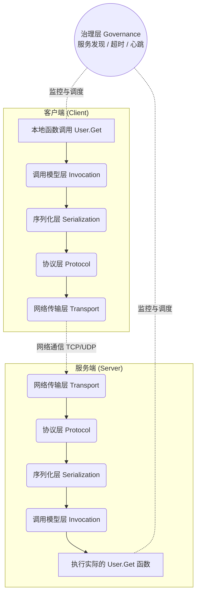

在分布式系统的开发中，经常会听到或者使用到 RPC（Remote Procedure Call，远程过程调用）。RPC 的核心目标：**让你调用远程服务器上的函数，就像调用本地函数一样**

但网络是不可靠的，两台机器之间的交互充满着字节流的解析、网络延迟、甚至断线。所以一个优秀的 RPC 框架是就是在底层屏蔽掉这些复杂的细节

通常来说，一个成熟的 RPC 框架需要处理粘包/拆包（Framing）、序列化与反序列化（Marshaling）、路由分发（Routing）、并发模型管理（Concurrency），以及错误与状态传递（Status & Context）。

## 第一层：协议设计 (Protocol Design) 

这是整个框架的地基。需要定义通信双方怎么“说话”。不能仅仅把一个 JSON 字符串扔进 Socket 就完事了，因为 TCP 是面向字节流的，**流是没有边界的**。

在这一层，我们主要解决两个问题：

1. **定界（Framing），解决粘包/拆包**
   当连续发送多个请求时，接收端怎么知道哪里是一个完整的包？
   **通用解法：** 使用 Length-Prefixed（长度前缀法）。即给每个包加上长度头，比如 `[Header Length][Body Length][Header 字节][Body 字节]`。接收端先读长度，再按长度读取后续内容，完美解决。

2. **协议头（Header）设计**
   协议头就像快递单号上的元数据，通常需要包含：

   * `Magic Number` (魔数，如 `0xCAFEBABE`)：用来快速校验这是一个合法的协议包，防止乱码或恶意端口扫描直接拖垮服务。

   * `Version` (版本号，如 `v1`)：为了日后的协议平滑升级做准备。

   * `Serializer Type` (如 `1=Protobuf`, `2=JSON`)：告诉接收端 Body 应该用哪种方式解码。

   * `Message Type`：区分当前包是 Request、Response、Heartbeat（心跳包）还是 Oneway（单向通知）。

   * `Request ID / SeqID` (请求序号)：它是异步通信的关键。客户端发出去的 ID=100，服务端处理完带回 ID=100。客户端收到后才知道“哦，这是刚才那个请求的回复”。（后面我们在调用模型层会详细聊这个机制）。

## 第二层：序列化层 (Serialization) —— 数据的翻译

这一层决定了在线路上跑什么样的数据结构。因为内存里的对象是无法直接在网络上传输的，必须把它变成字节序列。

在设计时，我们需要考虑：

1. **接口抽象**：
   框架内部应该定义一个标准的 Serializer 接口（包含 `Marshal` 和 `Unmarshal` 方法）。即使现在只打算支持 Protobuf，也一定要预留扩展点（比如 JSON、MsgPack 等）。

2. **多语言与 IDL (Interface Definition Language)**：
   如果是异构系统（比如前端 Node.js 调用后端 Java，或者 Go 调用 C++），单一语言原生的序列化方式就行不通了。这时候需要引入 IDL 作为通用的契约规范（比如 gRPC 的 `.proto` 文件）。通过中间翻译层，虽然会有一定的性能开销，但换来了跨语言调用的能力。

3. **安全性**： 如果使用特定语言自带的序列化（例如 Java 的 `Serializable`，或者 Go 的 `gob`），需要注意反序列化漏洞。尽量使用安全的、跨语言的数据描述格式。

## 第三层：网络传输层 (Transport) 

1. **IO 模型的选择**：

   * 在 C++ 或 Java (Netty) 中，通常需要借助 `epoll` / `reactor` 模型，通过事件驱动来管理大量的并发连接。

   * **Go 语言在这里有着天然的优势**：由于 Goroutine 的轻量级特性，我们通常可以直接 `net.Listen`，然后在一个 for 循环里 `Accept` 连接，对每个连接直接起一个 Goroutine去处理（`go handleConn(conn)`）。这种同步非阻塞的写法让 RPC 网络层的实现异常清爽。

2. **连接池 (Connection Pooling)**：
   每次调用都进行 TCP 三次握手是非常昂贵的。客户端需要维护一个长连接池，复用已有的连接。

3. **超时控制 (Timeout)**：
   **网络是不可靠的。** 在写数据时要设置 `SetWriteDeadline`，读数据时要 `SetReadDeadline`。

## 第四层：调用模型 (Invocation)/路由映射 (Routing)

服务端收到解析好的请求：`Service: "UserService"`, `Method: "GetUser"`。怎么变成调用内存里的 `userService.GetUser()`？

* **方案 A（反射 Reflection）**：运行时动态查找方法并调用。优点是灵活，框架写起来简单；缺点是性能有一定损耗。

* **方案 B（代码生成 Code Gen）**：像 gRPC 一样，通过预编译生成如 `_grpc.pb.go` 的桩代码，底层用 `switch-case` 硬编码直接调用。性能极佳，但开发期需要维护生成插件。

## 第五层：异常处理与治理 (Governance) 

1. **Panic 捕获：**

   * **服务端的业务代码写烂了 panic 了，绝对不能导致整个 Server 进程崩溃。必须在 handleConn 里用 defer recover() 兜底，并返回给客户端一个 "Internal Server Error"。**

2. **心跳保活 (Heartbeat)：**

   * **TCP 连接还在，但对面网线拔了？需要定时发心跳包检测死链。**