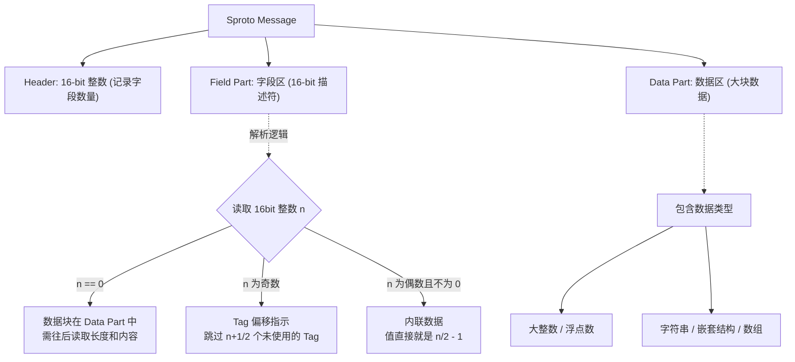

Sproto 是一个专门为 C 语言开发、并极其专注于 Lua 绑定的高效序列化库。类似 Protobuf，但实际跑起来，在 Lua 环境下它的速度往往要快得多。

## 为什么用 Sproto？

序列化方式业内标杆通常是 Protobuf。那为什么还要造 Sproto 这个“轮子”呢？我觉得可以归结为以下三个原因：

### 1. Lua 集成的性能损耗

Protobuf 官方对 Lua 的支持一直比较一般。市面上常见的方案往往是引入一个 C/C++ 库作为中间层去对接 Lua。
这里面有两个显著的开销：

* **跨语言交互开销**：C 与 Lua 交互需要频繁通过 Lua 虚拟机的虚拟栈，本身就存在性能开销。

* **临时对象开销**：Protobuf 在 C++ 层解析出会生成庞大的 C++ Struct/Class/Message 对象，然后再将这些对象的数据逐一提取，转换为 Lua Table。这个过程伴随着大量不必要的内存分配和数据拷贝，以及额外的GC开销。

相比之下，Sproto 是从一开始就**贴着 Lua 的数据结构来设计**的，直接将二进制流解析为 Lua Table，省去了中间繁重的 C 结构体转换。

### 2. 协议与 RPC 框架的解耦与复杂度

Protobuf 本质上只是一个数据交换格式（序列化方法）。如果我们要用它来做网络通讯，通常还需要在它之上再引入或开发一套 RPC（远程过程调用）框架（比如 gRPC）。这一整套设施搭建下来，对于一些追求敏捷和极致性能的团队来说，可能比自己重写一套还要沉重和复杂。
而 Sproto 的设计理念更加紧凑，它在协议层面就精简并内置了一套 RPC 机制（`host:dispatch` 和 `host:attach`），用一套极简的方案同时解决了序列化和通讯分发的问题。

### 3. Protobuf的历史包袱

Protobuf 为了支持跨语言、向下兼容以及应对各种复杂的业务场景，背负了较重的历史包袱。它的内部实现非常复杂，支持的类型众多，这也意味着代码和运行时的冗余。 如果我们的技术栈就是 C + Lua，那么一套为了该环境量身定制、砍掉冗余类型、高度精简的序列化与 RPC 方案，其执行效率显然会高得多。

## Sproto 的底层内存布局

为了理解 Sproto 为什么快，我们需要看看它是怎么对数据进行编码的。Sproto 的二进制 Wire Protocol（传输协议）设计得非常紧凑。

### 1. 核心结构划分

一条 Sproto 消息被分为三个清晰的部分：**Header (头部)**、**Field Part (字段描述区)**、**Data Part (数据区)**。

### 2. “内联”与数据分离策略

Sproto 采用了一种非常聪明的策略来压缩空间和提升解析速度：

* **小整数 / Boolean**：直接内联存储在 `Field Part`（字段区）中，根本不需要额外分配数据空间。

* **大整数 / 浮点数 / 字符串 / 嵌套类型**：这类不定长或占用较大的数据，Sproto 不做复杂的位压缩，而是直接丢进 **Data Part**，在 Field Part 中只标记一个 `0`。

### 3. 解析策略

在 Protobuf 中，由于字段的 Tag 是跟数据绑在一起的（Key-Value 形式），解析器在读取时需要根据每个 Key 来进行 `switch-case` 动态分发。
而 Sproto 强制要求**编码时必须按 Tag 进行严格排序**。这意味着解码器也是**按顺序从头读到尾**的，不需要进行昂贵的跳转操作，这在 CPU 的指令缓存命中率上具有的优势。

## Sproto 与 Protobuf的对比

在研究完内部机制后，我们再客观地对比一下这两者：

### 1. 运行效率

* **语言穿透成本**：如前所述，Protobuf 在市面上的库多需要在 C 和 Lua 之间来回跳跃转换。Sproto 利用原生的 Lua 序列化 API，避免了不必要的翻译层。

* **解析逻辑**：Sproto 强制的按序编码使得解析变成了极其高效的线性操作，而 Protobuf 必须基于 Tag 进行动态分发。

### 2. 压缩率（空间换时间 vs 时间换空间）

* Protobuf 广泛使用了 `Varint`（变长编码）来压缩所有整数，这意味着它在体积上通常更小，但在解包时需要不断地进行位运算（Shift 和 Mask），消耗 CPU 计算资源。

* Sproto 则可能在 `Field Part` 直接内联小数据，而对于大数据（如大整数、Double），它选择**不压缩**直接放入 `Data Part`。这是一个典型的“以空间换时间”的策略，解析大数据时基本只需一次内存拷贝（memcpy）。如果网络带宽不是极端瓶颈，这种策略的 CPU 效率更高。

### 3. GC（垃圾回收）压力

这可能是动态类型语言（如 Lua）在使用 Protobuf 时最大的痛点。

* Protobuf 在反序列化高频通讯协议（如游戏战斗帧同步）时，底层会不断 `new` 出新的中间数据结构，然后再转成 Lua 表，这会给 Lua 的 GC 带来极大的压力，容易造成游戏卡顿。

* Sproto 针对这点做了专门优化。在解析期间，C 层很多时候只是互相传递数据流的**指针**，尽可能推迟或减少内存分配，直至最终直接构造出目标 Lua Table，大幅降低了临时对象的产生。

### 4. 生态

当然，做技术选型不能只看优点。**Protobuf 的生态是碾压 Sproto 的。** 如果你需要和 Java后端、Go 微服务、Python 脚本等多种语言进行大一统的通讯，Protobuf 提供的完善工具链是无价的。而 Sproto 则更加“小而美”，它最合适的舞台就是 C 服务器与 Lua 客户端（或 C++ 与 Lua 业务层）之间的高速内网/游戏通讯。

## 总结

Sproto 并不是要完全取代 Protobuf，而是云风大神在面对特定业务场景（C + Lua 高频 RPC 交互）时，对性能和工程复杂度进行思考后的产物。

Protobuf 胜在生态繁荣与跨语言的普适性，而 Sproto 则是抛弃历史包袱，针对特定的语言环境（C/Lua）将数据结构优化到极致，带来的性能优势。

所以在做技术架构时，因地制宜才是最好的选择。
