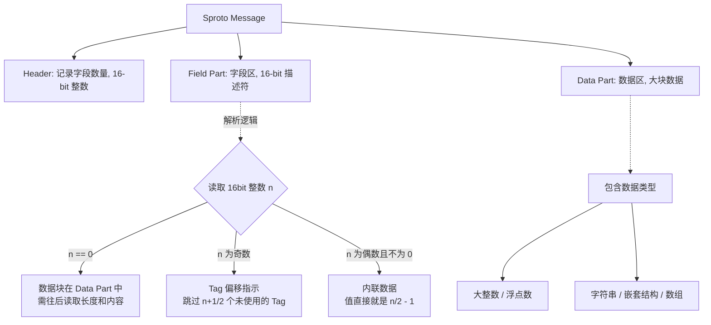

Sproto 是一个专门为 C 语言开发、并极其专注于 Lua 绑定的高效序列化库。类似 Protobuf，但实际跑起来，在 Lua 环境下它的速度往往要快得多。

## 为什么用 Sproto？

序列化方式业内标杆通常是 Protobuf。那为什么还要造 Sproto 这个“轮子”呢？我觉得可以归结为以下三个原因：

### 1. Lua 集成的性能损耗

Protobuf 官方对 Lua 的支持一直比较一般。市面上常见的方案往往是引入一个 C/C++ 库作为中间层去对接 Lua。
这里面有两个显著的开销：

* **跨语言交互开销**：C 与 Lua 交互需要频繁通过 Lua 虚拟机的虚拟栈，本身就存在性能开销。

* **临时对象开销**：Protobuf 在 C++ 层解析出会生成庞大的 C++ Struct/Class/Message 对象，然后再将这些对象的数据逐一提取，转换为 Lua Table。这个过程伴随着大量不必要的内存分配和数据拷贝，以及额外的GC开销。

相比之下，Sproto 是从一开始就**贴着 Lua 的数据结构来设计**的，直接将二进制流解析为 Lua Table，省去了中间繁重的 C 结构体转换。

### 2. 协议与 RPC 框架的解耦与复杂度

Protobuf 本质上只是一个数据交换格式（序列化方法）。如果我们要用它来做网络通讯，通常还需要在它之上再引入或开发一套 RPC（远程过程调用）框架（比如 gRPC）。这一整套设施搭建下来，对于一些追求敏捷和极致性能的团队来说，可能比自己重写一套还要沉重和复杂。
而 Sproto 的设计理念更加紧凑，它在协议层面就精简并内置了一套 RPC 机制（`host:dispatch` 和 `host:attach`），用一套极简的方案同时解决了序列化和通讯分发的问题。

### 3. Protobuf的历史包袱

Protobuf 为了支持跨语言、向下兼容以及应对各种复杂的业务场景，背负了较重的历史包袱。它的内部实现非常复杂，支持的类型众多，这也意味着代码和运行时的冗余。 如果我们的技术栈就是 C + Lua，那么一套为了该环境量身定制、砍掉冗余类型、高度精简的序列化与 RPC 方案，其执行效率显然会高得多。

## Sproto 的底层内存布局

为了理解 Sproto 为什么快，我们需要看看它是怎么对数据进行编码的。Sproto 的二进制 Wire Protocol（传输协议）设计得非常紧凑。

### 1. 核心结构划分

一条 Sproto 消息被分为三个清晰的部分：**Header (头部)**、**Field Part (字段描述区)**、**Data Part (数据区)**。



### 2. “内联”与数据分离策略

Sproto 采用了一种非常聪明的策略来压缩空间和提升解析速度：

* **小整数 / Boolean**：直接内联存储在 `Field Part`（字段区）中，根本不需要额外分配数据空间。

* **大整数 / 浮点数 / 字符串 / 嵌套类型**：这类不定长或占用较大的数据，Sproto 不做复杂的位压缩，而是直接丢进 **Data Part**，在 Field Part 中只标记一个 `0`。

### 3. 解析策略

在 Protobuf 中，由于字段的 Tag 是跟数据绑在一起的（Key-Value 形式），解析器在读取时需要根据每个 Key 来进行 `switch-case` 动态分发。
而 Sproto 强制要求**编码时必须按 Tag 进行严格排序**。这意味着解码器也是**按顺序从头读到尾**的，不需要进行昂贵的跳转操作，这在 CPU 的指令缓存命中率上具有的优势。

## 具体例子
这里按 sproto github 官方的例子来简单复盘下流程

### 1. 协议定义

假设我们有如下的 Sproto Schema 定义：

```
.Person {
    name 0 : string
    age 1 : integer
    marital 2 : boolean
    children 3 : *Person
}

```

接下来，我们在业务代码中创建了一个包含数组的 `Person` 对象（注意，这里刻意没有给 `marital` 字段赋值）：

```
person {
    name = "Bob",
    age = 40,
    children = {
        { name = "Alice" ,  age = 13 },
        { name = "Carol" ,  age = 5 },
    }
}

```

经过 Sproto 序列化后，产生的二进制 Hex 数据如下（注意这里是小端序）：

```
04 00 
00 00 
52 00 
01 00 
00 00 

03 00 00 00 
42 6F 62 

26 00 00 00 

0F 00 00 00 
02 00 
00 00 
1C 00 
05 00 00 00 
41 6C 69 63 65 

0F 00 00 00 
02 00 
00 00 
0C 00 
05 00 00 00 
43 61 72 6F 6C

```


### 2. 序列化流程

Sproto 的消息强制划分为三部分：`Header`、`Field Part` 和 `Data Part`。在编码时，严格按照 Tag 从小到大的顺序处理。

#### 第一步：构建主对象的 Header 与 Field Part

* **Header (`04 00`)**：
  注意，这里的值是 `4`。虽然我们只赋值了 name、age 和 children 3个字段，但 Sproto 是按**位置步进**记录的（Tag 0 到 Tag 3），因此需要 4 个描述位来覆盖这个跨度。

* **Field Part (按 Tag 顺序依次生成)**：

  1. **Tag 0 (name)**：字符串不可内联，记为 `00 00`，指示“去 Data 区找”。

  2. **Tag 1 (age = 40)**：小整数，直接内联。公式为 $(value + 1) \times 2$。$(40 + 1) \times 2 = 82$，十六进制为 `52 00`。

  3. **Tag 2 (marital 缺失)**：这是 Sproto 的一个设计, 如果字段缺失，为了保持解码时的顺序推进，必须写入一个**奇数**作为“跳跃标记”。跳过 1 个字段即记为 `01 00`。

  4. **Tag 3 (children)**：数组，不可内联，记为 `00 00`。

#### 第二步：组装主对象的 Data Part

在描述符写完后，依次追加那些标记为 `00 00` 的数据：

1. **追加 name ("Bob")**：
   前置 4 字节长度 `03 00 00 00`，紧跟 ASCII 数据 `42 6F 62`。

2. **追加 children 数组**：
   前置 4 字节数组总长度：`26 00 00 00`（十六进制 0x26 = 38 字节）。

#### 第三步：递归编码嵌套数组

数组内的元素就是独立的 `Person` 结构，因此按照相同的规则**递归**写入：

* **Child 1 (Alice)**：

  * 自身占据 15 字节，先写长度：`0F 00 00 00` (15)。

  * Header: 只有 tag 0 和 1，写 `02 00`。

  * Field Part: Tag 0 写 `00 00`；Tag 1 值为 13，算得 $(13 + 1) \times 2 = 28$，写 `1C 00`。

  * Data Part: Alice 长度 5 `05 00 00 00`，ASCII `41 6C 69 63 65`。
    *(刚好：2字节头部 + 4字节描述区 + 4字节长度 + 5字节字串 = 15 字节)*

* **Child 2 (Carol)**：

  * 同理，长 15 字节：`0F 00 00 00`。

  * Header: `02 00`。

  * Field Part: Tag 0 写 `00 00`；Tag 1 值为 5，算得 $(5+1)\times 2 = 12$，写 `0C 00`。

  * Data Part: Carol 长度 5 `05 00 00 00`，ASCII `43 61 72 6F 6C`。

### 3. 解析流程

1. **线性扫描**：读取头部发现 `04 00`，知道接下来有 4 个描述符。

2. **游标推进**：

   * 读到 `00`，意味着遇到大数据，把当前指针地址推入一个待处理队列，Tag 计数器 + 1。

   * 读到 `52` (偶数)，逆向推导 $82 / 2 - 1 = 40$，直接在内存中给 age 赋值为 40，Tag 计数器 + 1。

   * 读到 `01` (奇数)，说明字段缺失，**直接让 Tag 计数器 + 1**（跳过 Tag 2），无需为 marital 分配任何操作。

   * 读到 `00`，再次推入待处理队列，Tag 计数器 + 1。

3. **数据按需提取**：
   Field Part 扫完后，按顺序去读取待处理队列中的数据。遇到数组 `children` 时，因为有前置的 `26 00 00 00`（总长 38），解码器可以**一次性知道要跨越的内存范围**。接着进入递归，解析逻辑与主干完全一致。

### 4. 从这个例子可以看出它的优势


* **内存布局**：
  在动态语言（如 Lua）中，创建一个 table 并为其字段赋值是有开销的。Sproto 这种强顺序的设计，允许 C 层在扫过 Field Part 时，瞬间把所有小整数和布尔值凑齐。这就好比**不用去字典里查词，而是按着清单一条条划掉**，对 CPU 缓存极为友好。

* **缺省字段**：
  Protobuf 对缺失字段的处理是不写 Tag。Sproto 则是写一个奇数（如 `01 00`）。虽然看似多花了 2 个字节，但这保证了解码时依然保持“线性遍历”，彻底干掉了 `switch-case` 带来的分支预测惩罚。

* **块状数据的快速跳过（Length-Prefix）**：
  所有的嵌套结构（数组、字符串）都带有明确的 4 字节长度。如果我们在业务上不需要读取 `children` 数组，解码器拿到 `38` 这个长度后，可以直接将内存指针拨快 38 字节，瞬间跳过庞大的子结构。这种按需解析（Lazy Parsing）在处理大型协议帧时具有巨大的性能收益。


## Sproto 与 Protobuf的对比

在研究完内部机制后，我们再客观地对比一下这两者：

### 1. 运行效率

* **语言穿透成本**：如前所述，Protobuf 在市面上的库多需要在 C 和 Lua 之间来回跳跃转换。Sproto 利用原生的 Lua 序列化 API，避免了不必要的翻译层。

* **解析逻辑**：Sproto 强制的按序编码使得解析变成了极其高效的线性操作，而 Protobuf 必须基于 Tag 进行动态分发。

### 2. 压缩率（空间换时间 vs 时间换空间）

* Protobuf 广泛使用了 `Varint`（变长编码）来压缩所有整数，这意味着它在体积上通常更小，但在解包时需要不断地进行位运算（Shift 和 Mask），消耗 CPU 计算资源。

* Sproto 则可能在 `Field Part` 直接内联小数据，而对于大数据（如大整数、Double），它选择**不压缩**直接放入 `Data Part`。这是一个典型的“以空间换时间”的策略，解析大数据时基本只需一次内存拷贝（memcpy）。如果网络带宽不是极端瓶颈，这种策略的 CPU 效率更高。

### 3. GC（垃圾回收）压力

这可能是动态类型语言（如 Lua）在使用 Protobuf 时最大的痛点。

* Protobuf 在反序列化高频通讯协议（如游戏战斗帧同步）时，底层会不断 `new` 出新的中间数据结构，然后再转成 Lua 表，这会给 Lua 的 GC 带来极大的压力，容易造成游戏卡顿。

* Sproto 针对这点做了专门优化。在解析期间，C 层很多时候只是互相传递数据流的**指针**，尽可能推迟或减少内存分配，直至最终直接构造出目标 Lua Table，大幅降低了临时对象的产生。

### 4. 生态

当然，做技术选型不能只看优点。**Protobuf 的生态是碾压 Sproto 的。** 如果你需要和 Java后端、Go 微服务、Python 脚本等多种语言进行大一统的通讯，Protobuf 提供的完善工具链是无价的。而 Sproto 则更加“小而美”，它最合适的舞台就是 C 服务器与 Lua 客户端（或 C++ 与 Lua 业务层）之间的高速内网/游戏通讯。

## 总结

Sproto 并不是要完全取代 Protobuf，而是云风大神在面对特定业务场景（C + Lua 高频 RPC 交互）时，对性能和工程复杂度进行思考后的产物。

Protobuf 胜在生态繁荣与跨语言的普适性，而 Sproto 则是抛弃历史包袱，针对特定的语言环境（C/Lua）将数据结构优化到极致，带来的性能优势。

所以在做技术架构时，因地制宜才是最好的选择。
